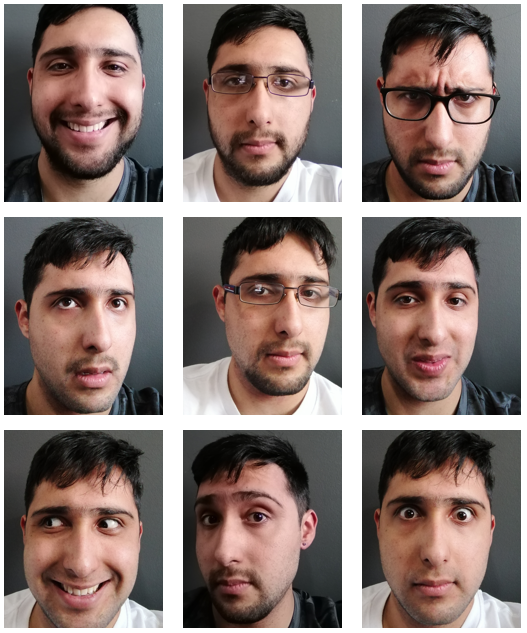
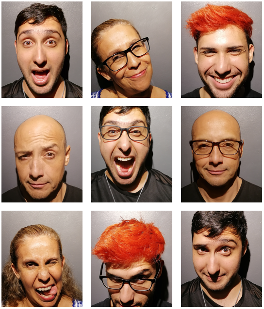
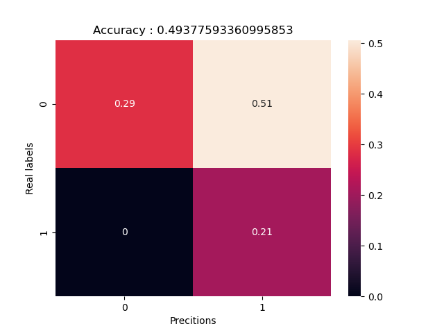
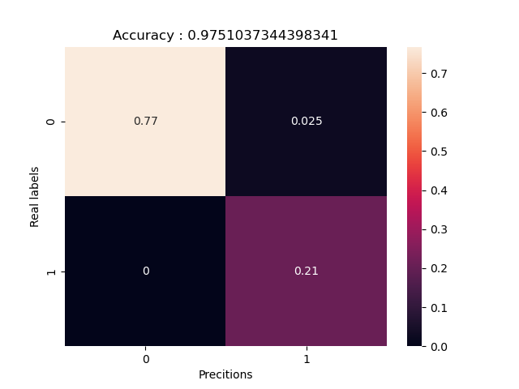
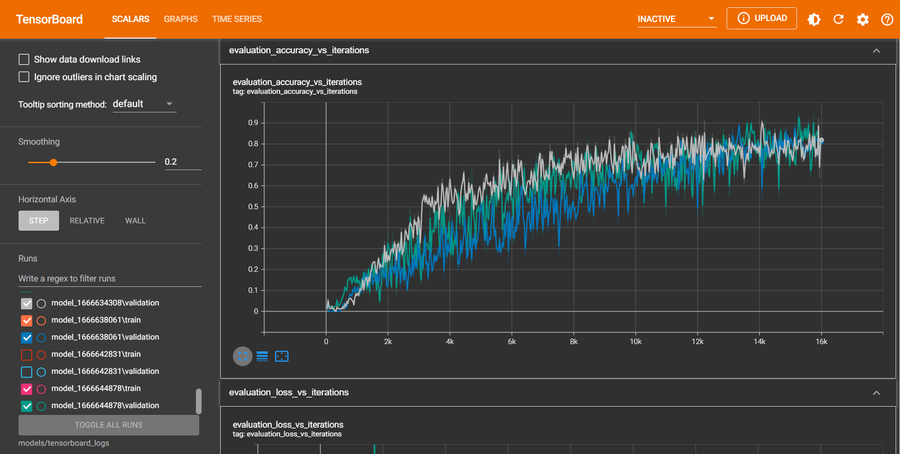
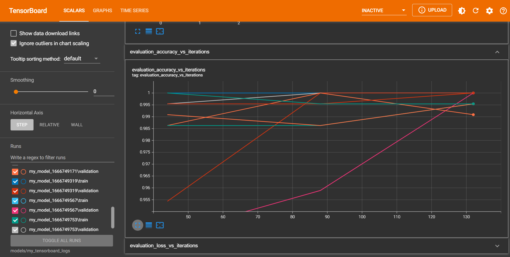

# Reconocimiento-facial
## Estrategia general
Primeramente, se utilizó la base de datos [AT&T Database of Faces](https://www.kaggle.com/datasets/kasikrit/att-database-of-faces?select=README) para pre-entrenar una red neuronal artificial que clasificara imágenes de 40 personas distintas. Esta red consistió en varios bloques de capas convolucionales con pooling y un clasificador de capas densamente conectadas con 40 salidas. Se utilizó aumentado de datos (rotación, traslación, zoom y espejo en *x*) durente el entrenamiento de esta fase para intentar evitar el sobreajuste a las imágenes.

Después, se congelaron los parámetros de los bloques convolucionales y se reemplazó el clasificador con uno nuevo que determinara si la persona de la imagen era *Jorge Carrasco* o no. Esta nueva red se entrenó con imágenes del sujeto en cuestión (convertidas a escala de grises) e imágenes de la base de datos [AT&T Database of Faces](https://www.kaggle.com/datasets/kasikrit/att-database-of-faces?select=README). Durante esta etapa también se utilizó aumentado de datos (rotación, traslación, zoom y espejo en *x*) en el entrenamiento de esta fase para intentar evitar el sobreajuste a las imágenes.

Finalmente, se eligieron 9 modelos candidatos para prueba con una nueva base de datos de imágenes (convertidas a escala de grises) del sujeto en cuestión y de sus familiares cercanos para determinar la precisión de los modelos.

## Problemas que se encontraron
Algunos de los problemas que surgieron durante la realización del proyecto fueron la carga de los datos desde las carpetas, implementar el aumentado de datos dependiendo de la forma en que se cargaron las bases de datos, ejecutar TensorBoard desde la terminal de Anaconda en el directorio correcto, determinar una arquitectura de red apropiada, agregar un callback que redujera la tasa de aprendizaje dada cierta condición y llevar un registro organizado de los modelos propuestos y los hiperparámetros utilizados durante el entrenamiento.

## Intentos que dieron buenos y malos resultados
A pesar de que los 9 modelos candidatos fueron los mejores en precisión con el conjunto de validación durante la segunda etapa, algunos de estos modelos tuvieron una precisión lamentable durante la fase de prueba, llegando a precisiones tales como 62.24% o incluso 49.377%.

Así mismo, los mejores de estos 9 modelos obtuvieron precisiones del 95.435%, 95.85% y 97.51% durante la fase de prueba.

Todos los intentos y modelos con los detalles del entrenamiento y gráficas de la precisión y *loss* con respecto a las épocas pueden encontrarse en el directorio */models*, donde el formato */models/model_* indica que es un modelo de la fase de pre-entrenamiento y el formato */models/my_model_* indica que es un modelo de la fase de entrenamiento.

## Modelo final
La red que obtuvo mejores resultados en la fase de prueba (una precisión del 97.51%) tiene la siguiente estructura:

### Model: "sequential"

| Layer (type)                   | Output Shape        | Param # |
| ------------------------------ | ------------------- | :-----: |
| sequential (Sequential)        | (None, 112, 92, 1)  | 0       |
| rescaling (Rescaling)          | (None, 112, 92, 1)  | 0       |
| conv2d (Conv2D)                | (None, 109, 89, 64) | 1088    |
| max_pooling2d (MaxPooling2D)   | (None, 54, 44, 64)  | 0       |
| conv2d_1 (Conv2D)              | (None, 51, 41, 128) | 131200  |
| max_pooling2d_1 (MaxPooling2D) | (None, 25, 20, 128) | 0       |
| conv2d_2 (Conv2D)              | (None, 22, 17, 128) | 262272  |
| max_pooling2d_2 (MaxPooling2D) | (None, 11, 8, 128)  | 0       |
| flatten (Flatten)              | (None, 11264)       | 0       |
| dense (Dense)                  | (None, 20)          | 225300  |
| dense_1 (Dense)                | (None, 1)           | 21      |

*Total params: 619,881*

*Trainable params: 225,321*

*Non-trainable params: 394,560*

donde el primer bloque *sequential* es el aumentado de datos y la capa *rescaling* reescala los valores de los pixeles del intervalo 0 - 255 al intervalo 0 - 1.

### Hiperparámetros de entrenamiento
- image_size      : (112, 92)
- batch_size      : 10
- epochs          : 3
- last_activation : sigmoid
- loss            : binary_crossentropy
- learning_rate   : 0.001
- optimizer       : adam
- seed            : 2022

### TensorBoard pre-entrenamiento

### TensorBoard entrenamiento

## Conclusiones
En conclusión, se obtuvieron buenos resultados en la clasificación de rostros del sujeto en cuestión incluso cuando se utilizaron imágenes con y sin lentes, poses faciales normales y muecas exageradas, peinados distintos y ángulos ligeramente descentrados de él y de sus familiares cercanos. También se lograron superar todos los problemas encontrados durante la realización del proyecto, lo cual aportó sustancialmente al aprendizaje del uso de Tensorflow, Keras y TensorBoard.